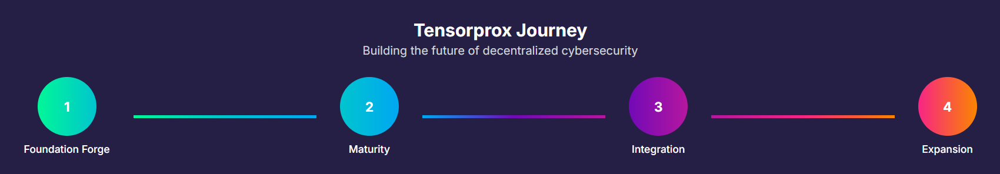
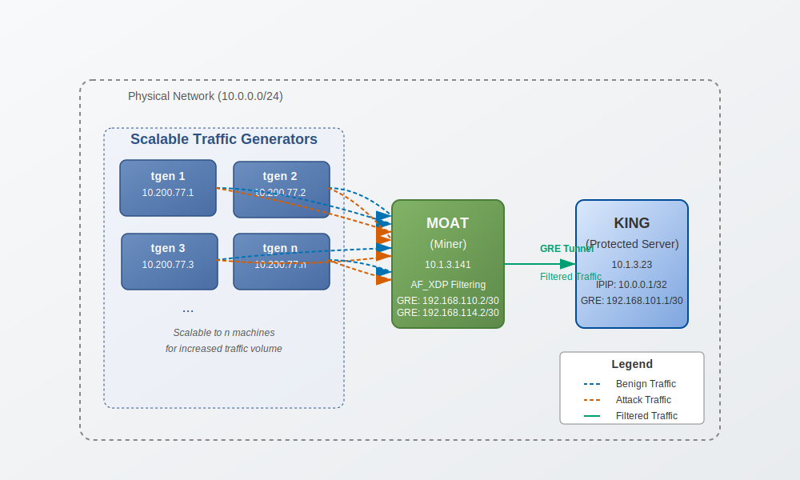
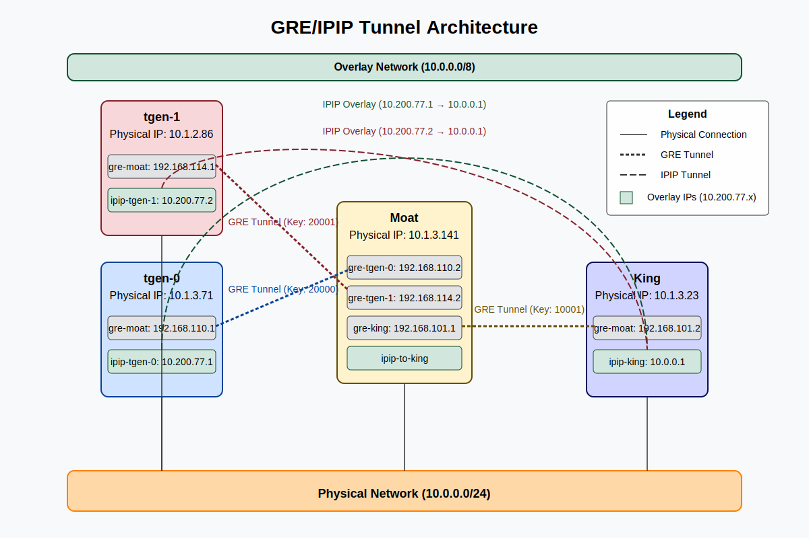
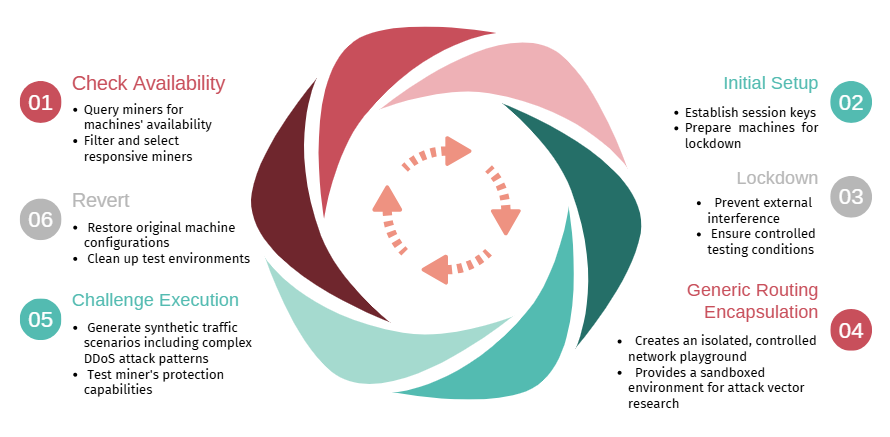

<picture>
    <source srcset="./assets/shugo_white.png" media="(prefers-color-scheme: dark)">
    <source srcset="./assets/shugo_black.png" media="(prefers-color-scheme: light)">
    
</picture>


<div align="center">

# **Tensorprox: SN234** <!-- omit in toc -->
[](https://discord.gg/bittensor)
[](https://creativecommons.org/licenses/by-nc/4.0/deed.en)

---

### The Incentivized DDoS Scrubbing Center <!-- omit in toc -->

[Discord](https://discord.gg/bittensor) • [Taostats](https://taostats.io/) • [Linkedin](https://www.linkedin.com/company/105804417/admin/dashboard/) • [Twitter](https://x.com/shugoio)

</div>

---

This repository is the **official codebase for Bittensor Subnet 234 (SN234) v0.1.0+**. To learn more about the Bittensor project and the underlying mechanics, [read here.](https://docs.bittensor.com/)

<br/>
<div align="center">

# How to start ?

**[Run A Validator Node](./assets/validator.md)** · **[Run A Miner Node](./assets/miner.md)**

</div>
<br/>

🚨 Tensorprox by Shugo.io is building the future of decentralized cybersecurity.<br/>
Our journey is shaped by 4 powerful phases:<br/>
1️⃣ **Foundation Forge** – Core architecture, synthetic attack simulation, performance-based competition ✅<br/>
2️⃣ **Maturity** – Smarter detection, faster scaling, cooperative defense 🧠<br/>
3️⃣ **Integration** – One-click, plug-and-play protection for any user or subnet node 🔌<br/>
4️⃣ **Expansion** – Enterprise-grade, globally redundant, threat-intelligent defense 🌍<br/>
We’re done laying the foundation—soon, anyone can deploy powerful DDoS protection in seconds.<br/>
From sandbox to safeguard, Tensorprox is making protection automatic, scalable, and decentralized.<br/>



# Introduction

Tensorprox introduces a novel approach to **DDoS protection** with a distributed architecture and an innovative incentive mechanism powered by the **Bittensor Network**. The validation process leverages **synthetic traffic generation**, alternating between normal and malicious network behaviors to simulate realistic attack scenarios. This project aims to evolve into a **global cybersecurity solution**, tackling the most complex security challenges.

# Core Conceptual Design

Tensorprox redefines distributed DDoS mitigation by simulating complex network environments and evaluating miner performance in high-stress scenarios.
The subnet operates on a unique distributed network architecture where:
- **Validators** challenge miners by simulating real-world DDoS scenarios
- **Miners** provide DDoS protection services
- Performance is evaluated through comprehensive **traffic analysis**

It employs a novel architectural design to build a robust and adaptable mitigation system. This design strategically positions key components to ensure comprehensive protection of the target server, referred to as the "King".

**King**: It represents the target server requiring protection.

**Traffic generators**: These machines (tgens) generate a blend of traffic, dynamically configured per round to simulate varying network conditions, including DDoS spikes and legitimate traffic flows.

**Moat**: It is run by miners and acts as a routing firewall. The Moat leverages Advanced Forwarding eXpress Data Path (AF_XDP) for high-performance packet processing.

The system works by positioning the Moat strategically between the traffic generators and the King. All traffic must pass through the Moat, which analyzes and filters it based on pre-defined rules and dynamically learned patterns. 



**Note**: For scalability reasons, access to the traffic generator and King machines must be provided by the miner to the validator via SSH connections.

# Scalable and Balanced Network Growth 

Tensorprox enables progressive scalability through competitive bandwidth handling, allowing miners to gradually increase the number of tgen machines over time. This design incentivizes miners to process higher volumes of network traffic (see Reward Mechanism), promoting scale and performance. To prevent abuse and ensure quality, the multi-factor reward function balances throughput with traffic filtering accuracy and latency efficiency. Miners must maintain a high mitigation ratio and low response times to benefit from additional tgen deployments, fostering a natural equilibrium between scale and effectiveness.


# GRE/IPIP Tunnel Architecture

To support secure and flexible experimentation, this architecture relies on GRE and IPIP tunnels to establish a sandboxed overlay network that faithfully simulates real-world traffic conditions without being constrained by ISP-level limitations. This allows us to model complex network behaviors, including IP spoofing scenarios, within a secure and ethical research context. The use of tunneling ensures that all interactions remain confined to an isolated overlay network, providing full control over traffic flow and enabling precise evaluation of network defense mechanisms such as traffic filtering, latency management, and anomaly detection.





## Network Architecture Overview

The Tensorprox system employs a sophisticated network topology utilizing GRE tunnels to create a secure, flexible overlay network. The architecture consists of interconnected nodes within the 10.0.0.0/24 physical network, establishing a complex tunnel infrastructure.

### Network Nodes

1. **Traffic Generator (tgen-0) (10.1.3.71)**
   - Physical interface on 10.0.0.0/24 network
   - GRE tunnel to Moat (gre-moat: 192.168.110.1/30)
   - IPIP tunnel (ipip-tgen-0) with overlay IP: 10.200.77.1/32

2. **Traffic Generator (tgen-1) (10.1.2.86)**
   - Physical interface on 10.0.0.0/24 network
   - GRE tunnel to Moat (gre-moat: 192.168.114.1/30)
   - IPIP tunnel (ipip-tgen-1) with overlay IP: 10.200.77.2/32

3. **Moat Node (10.1.3.141)**
   - Physical interface on 10.0.0.0/24 network
   - Multiple GRE tunnels:
     * To Tgen-0 (gre-tgen-0: 192.168.110.2/30)
     * To Tgen-1 (gre-tgen-1: 192.168.114.2/30)
     * To King (gre-king: 192.168.101.1/30)
   - IPIP tunnel to King for encapsulation

4. **King Node (10.1.3.23)**
   - Physical interface on 10.0.0.0/24 network
   - GRE tunnel to Moat (gre-moat: 192.168.101.2/30)
   - IPIP tunnel (ipip-king) with overlay IP: 10.0.0.1/32

## Traffic Flow Mechanics

### Tgen-0 to King Traffic Flow
1. Traffic originates from Benign (10.200.77.1) to King (10.0.0.1)
2. Routed via gre-moat interface
3. Encapsulated in GRE and sent to Moat
4. Moat receives on gre-tgen-0 interface
5. Forwarded through gre-king to King
6. King processes packet through ipip-king interface

### Tgen-1 to King Traffic Flow
1. Traffic originates from Attacker (10.200.77.2) to King (10.0.0.1)
2. Routed via gre-moat interface
3. Encapsulated in GRE and sent to Moat
4. Moat receives on gre-tgen-1 interface
5. Forwarded through gre-king to King
6. King processes packet through ipip-king interface

## Key Architectural Features

1. **Multi-level Encapsulation**
   - IPIP tunnels provide custom overlay network addressing
   - GRE tunnels secure and direct traffic between nodes

2. **Advanced Routing Priorities**
   - Specific routes for known endpoints (10.200.77.x) with metric 100
   - Flexible overlay network routing (10.0.0.0/8)

3. **Security Isolation**
   - GRE keys ensure traffic separation and authentication
   - Distinct IP subnets for tunnel pairs

4. **Network Flexibility**
   - 10.0.0.0/8 routing allows dynamic IP additions
   - Scalable overlay network configuration

## Kernel Optimization Techniques

To maximize network performance, the system implements:
- IP forwarding enablement
- Reverse path filtering disablement
- Increased TCP buffer sizes
- BBR congestion control
- MTU optimization to minimize fragmentation


# Validation Round Lifecycle



# Reward Mechanism

## Overview

The scoring system evaluates miners based on their ability to **protect the King** by blocking attacks and handling **high volume of packets** with **low latency**.

### Reward Calculation Components

The reward function is composed of four key metrics:


1. **Benign Delivery Rate (BDR)** - 25% Weight
   - Evaluates the efficiency of forwarding normal traffic
   - Calculated as: 
   ```
   BDR = (exp((total_reaching_benign / total_benign_sent)**2) - 1) / (exp(1) - 1)
   ```

2. **Attack Mitigation Accuracy (AMA)** - 25% Weight
   - Measures the ability to detect and block malicious traffic
   - Calculated as: 
   ```
   AMA = (exp((1 - (total_reaching_attacks / total_attacks_sent))**2) - 1) / (exp(1) - 1)
   ```

3. **Selective Processing Score (SPS)** - 20% Weight
   - Measures traffic purity: out of all packets that reached the King, what percentage was benign ?
   - Calculated as: 
   ```
    SPS = (exp((total_reaching_benign / total_reaching_packets)**2) - 1) / (exp(1) - 1)
   ```

4. **Relative Throughput Capacity (RTC)** - 15% Weight
   - Assesses the miner’s ability to process and forward benign traffic volume compared to other miners in the same round.
   - Ratio of total packets processed (sum of benign packets forwarded and attack packets blocked) by a miner to the highest number of packets processed by any miner in a given round :
   ```
   RTC = total_reaching_benign / max_reaching_benign
   ```

5. **Latency Factor (LF)** - 15% Weight
   - Assesses response time and network performance
   - Calculated using log-based normalized Round-Trip Time (RTT): 
   ```
   LF = 1 / (1 + log(AVG_RTT + 1)**3 / 10)
   ```

### Scoring Method

The final reward is calculated using a weighted sum:

```
Reward = (0.25 * BDR) + (0.25 * AMA) + (0.2 * SPS) + (0.15 * RTC) + (0.15 * LF)
```


# Restricted Validator Access: Whitelist-Agent

## Access Control Architecture

Tensorprox implements a **restrictive security model** to ensure validators can only execute predefined commands during the validation process. This is achieved through a custom `whitelist-agent` that provides **granular control** over remote command execution.

### Key Security Features

1. **Restricted User Creation**
   - Each miner creates a dedicated system user with limited privileges
   - SSH access is confined to a single, purpose-specific user account

2. **Command Whitelist**
   - Only pre-approved commands can be executed remotely
   - Strict allowlist prevents unauthorized command execution

3. **Validated Command Execution**
   - Every SSH command undergoes comprehensive validation
   - Command paths are normalized and checked against the allowlist
   - Unauthorized commands are immediately rejected

### Allowed Commands Example

The whitelist includes only essential commands for the validation process:
- SSH connection maintenance
- Specific scripts needed for the full round execution:
  - `initial_setup.sh`
  - `challenge.sh`
  - `lockdown.sh`
  - `revert.sh`
  - `gre_setup.py`
  - `traffic_generator.py`

### Security Workflow

1. Validator initiates SSH connection
2. `whitelist-agent` intercepts the connection
3. Proposed command is checked against allowlist
4. Command is either:
   - Executed if whitelisted
   - Rejected if not authorized


**Note**: Miners **must run** the `restrict.sh` script on all remote machines before joining the network for security reasons.
Always conduct thorough security audits and testing in controlled environments before network deployment.


# Security Guarantees

- **Principle of Least Privilege**: Miners expose only required functionality
- **No Direct Shell Access**: Prevents interactive shell sessions
- **Script Integrity Verification**: Validators ensure the integrity of all scripts used during the round by performing SHA-256 checksum comparisons before execution. This prevents unauthorized modifications by miners, ensuring that only tamper-free scripts are executed during the validation process.


# Technical Highlights

## Dynamic Miner Selection
- Implements a **time-synchronized** seed to generate **deterministic**, **unpredictable miner distributions**
- Asynchronous aiohttp-based validator readiness checks ensure **dynamic network mapping**
- **Guarantees Mutual Exclusivity**: mathematically ensures zero miner subset overlap across all active validators

## Epoch Management

- Periodic validation cycles
- **Synchronization across all validators** achieved through universal timestamp-based trigger
- Provides deterministic round progression **without centralized coordinator**

## Whitelist-Agent

- Granular Access Control: Restricts remote command execution
- Implements strict command allowlisting
- Validates every SSH command against pre-approved whitelist

## Script Integrity Verification

SHA-256 Checksum Validation: Ensures script authenticity before execution


# Contribution

We welcome contributions! Detailed guidelines will be published soon.

# License

Licensed under the **Creative Commons Attribution-NonCommercial 4.0 International (CC BY-NC 4.0)**.

## Licensing Terms
- Non-commercial use permitted
- Commercial use restricted to mining/validating within TensorProx subnet
- Commercial licensing requests: Contact **Shugo LTD**

# Contact

Join our [Discord](https://discord.gg/bittensor) for community support and discussions.

---

**Disclaimer**: Tensorprox is an experimental DDoS mitigation network. Always conduct thorough testing in controlled environments.